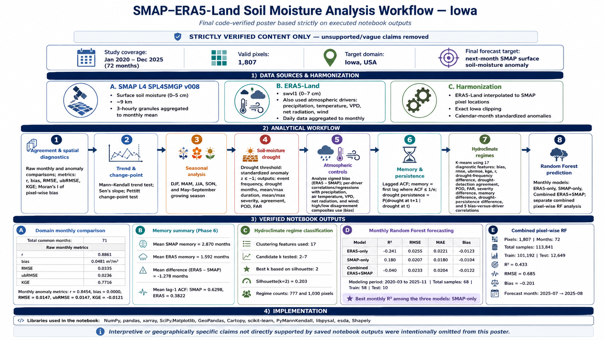

# SMAP-L4 & ERA5-Land Soil Moisture Analysis Across Iowa

### Satellite–reanalysis comparison, drought diagnostics, persistence, hydroclimate regimes, and next-month soil-moisture prediction


This repository presents a reproducible geospatial analysis of **NASA SMAP Level-4** and **ERA5-Land** surface soil moisture across Iowa. The workflow evaluates agreement between the two products, their representation of soil-moisture drought and persistence, spatial hydroclimate regimes, and the predictability of next-month SMAP anomalies using Random Forest models.

---

## Workflow

<p align="center">
  
</p>

---

## Research scope

The analysis focuses on four questions:

1. How closely do SMAP L4 and ERA5-Land represent the same monthly surface soil-moisture variability?
2. How do their differences change spatially, seasonally, and during soil-moisture drought?
3. How do the products differ in soil-moisture memory and persistence?
4. Can current soil-moisture and atmospheric conditions predict **next-month SMAP surface soil-moisture anomaly**?

The comparison is performed at both the **Iowa-wide monthly scale** and the **individual-pixel scale**.

> **Important:** No independent in-situ soil-moisture network is used as ground truth in this analysis. SMAP–ERA5 differences are therefore interpreted as **dataset disagreement**, not strictly as observational error.

---

## Data

### SMAP Level-4

- Product: **SPL4SMGP v008**
- Variable: surface soil moisture
- Approximate depth: **0–5 cm**
- Approximate spatial resolution: **9 km**
- Source data: **3-hourly granules**
- Analysis frequency: monthly

### ERA5-Land

- Soil-moisture variable: **`swvl1`**
- Approximate depth: **0–7 cm**
- Source frequency: daily
- Analysis frequency: monthly

ERA5-Land atmospheric variables used in the analysis include:

- precipitation
- 2-m air temperature
- vapor pressure deficit (VPD)
- net radiation
- wind speed

### Analysis domain

| Property | Value |
|---|---|
| Study area | Iowa, USA |
| Study period represented in pixel-wise arrays | 2020–2025 |
| Monthly pixel-wise time steps | 72 |
| Valid Iowa pixels | **1,807** |
| Common months in statewide SMAP–ERA5 comparison | **71** |

ERA5-Land was interpolated to the SMAP pixel locations, and only pixels inside the Iowa boundary were retained.

---

## Analysis pipeline

### 1 — SMAP–ERA5 agreement

Agreement was evaluated using:

- Pearson correlation coefficient (`r`)
- mean bias
- RMSE
- unbiased RMSE (`ubRMSE`)
- Kling–Gupta Efficiency (`KGE`)

The pixel-wise ERA5−SMAP bias field was additionally evaluated using **Moran's I** to test for spatial autocorrelation.

### 2 — Trend and change-point diagnostics

Temporal behavior was examined using:

- Mann–Kendall trend test
- Sen's slope
- Pettitt change-point test

These analyses were applied independently to the SMAP and ERA5-Land monthly records.

### 3 — Seasonal comparison

Metrics were evaluated separately for:

- DJF
- MAM
- JJA
- SON
- **May–September growing season**

This separates seasonal behavior from the annual soil-moisture cycle.

### 4 — Soil-moisture drought

Monthly anomalies were standardized by calendar month.

A drought month is defined as:

\[
z \leq -1
\]

Consecutive drought months were grouped into individual events.

The drought analysis calculates:

- drought-event frequency
- total drought months
- mean and maximum event duration
- mean and maximum severity
- SMAP–ERA5 drought agreement
- probability of detection (`POD`)
- false alarm ratio (`FAR`)

### 5 — Atmospheric controls

The signed soil-moisture difference

\[
\mathrm{Bias} = \mathrm{ERA5-Land} - \mathrm{SMAP}
\]

was related separately to:

- precipitation
- temperature
- VPD
- net radiation
- wind speed

The workflow evaluates per-driver relationships and contrasts periods of relatively high and low disagreement.

### 6 — Soil-moisture memory

Monthly standardized anomalies were analyzed using lagged autocorrelation.

The memory timescale is defined as the first lag at which:

\[
ACF \leq \frac{1}{e}
\]

Drought persistence was also calculated as:

\[
P(D_{t+1}\mid D_t)
\]

where \(D_t\) indicates drought at month \(t\).

### 7 — Hydroclimate regimes

K-means clustering was applied using **17 diagnostic features**:

1. bias  
2. RMSE  
3. ubRMSE  
4. KGE  
5. Pearson `r`  
6. drought-event-frequency difference  
7. drought detection agreement  
8. probability of detection  
9. false alarm ratio  
10. drought-severity difference  
11. soil-moisture-memory difference  
12. drought-persistence difference  
13. bias–precipitation correlation  
14. bias–VPD correlation  
15. bias–temperature correlation  
16. bias–radiation correlation  
17. bias–wind correlation  

Candidate solutions from **k = 2 through k = 7** were tested.

The executed notebook selected:

**k = 2**

with a silhouette score of:

**0.203**

Pixel counts were:

- **Regime 1:** 777
- **Regime 2:** 1,030

### 8 — Random Forest forecasting

The prediction target is:

> **Next-month SMAP surface soil-moisture anomaly**

Three statewide monthly Random Forest configurations were evaluated:

- ERA5-only
- SMAP-only
- Combined ERA5 + SMAP

A separate **combined pixel-wise Random Forest** analysis was also performed.

---

# Verified numerical results

## Statewide SMAP–ERA5 comparison

| Metric | Raw monthly comparison |
|---|---:|
| Pearson `r` | **0.8861** |
| Bias | **+0.0481 m³/m³** |
| RMSE | **0.0535 m³/m³** |
| ubRMSE | **0.0236 m³/m³** |
| KGE | **0.7716** |

For monthly standardized anomalies:

| Metric | Value |
|---|---:|
| Pearson `r` | 0.8454 |
| Bias | 0.0000 |
| RMSE | 0.0147 |
| ubRMSE | 0.0147 |
| KGE | −0.0121 |

---

## Soil-moisture memory

| Quantity | Mean |
|---|---:|
| SMAP memory | **2.870 months** |
| ERA5-Land memory | **1.592 months** |
| ERA5 − SMAP memory | **−1.278 months** |
| SMAP lag-1 ACF | **0.630** |
| ERA5 lag-1 ACF | **0.382** |

In the executed notebook, **SMAP shows the longer mean monthly memory timescale**.

---

## Monthly Random Forest results

The monthly modeling dataset contains:

- **68 total monthly samples**
- **58 training samples**
- **10 testing samples**
- modeling period: **2020-03 to 2025-11**

| Model | R² | RMSE | MAE | Bias |
|---|---:|---:|---:|---:|
| ERA5-only | −0.241 | 0.0255 | 0.0221 | −0.0123 |
| **SMAP-only** | **0.180** | **0.0207** | **0.0180** | −0.0104 |
| Combined ERA5 + SMAP | −0.040 | 0.0233 | 0.0204 | −0.0122 |

For this experiment, **SMAP-only produced the highest test R²**.

---

## Combined pixel-wise Random Forest

The separate combined pixel-wise experiment contains:

| Property | Value |
|---|---:|
| Pixels | **1,807** |
| Total samples | **113,841** |
| Training samples | **101,192** |
| Testing samples | **12,649** |
| R² | **0.433** |
| RMSE | **0.685** |
| Bias | **−0.201** |

Example forecast:

**July 2025 → August 2025**

The statewide monthly and pixel-wise models are separate experiments and their metrics should not be directly compared as if they represent the same evaluation design.

---

# Selected visual results

## Pixel-wise mean bias

<p align="center">
  
</p>

**Figure 2 — Pixel-wise Mean Bias (ERA5-Land − SMAP).**

---

## Seasonal and growing-season comparison

<p align="center">
  
</p>

**Figure 16 — Seasonal and Growing-Season ERA5-Land − SMAP Bias.**

---

## Drought detection and agreement

<p align="center">
  
</p>

**Figure 27 — SMAP–ERA5-Land Drought Detection and Agreement Diagnostics.**

---

## Hydroclimate regime selection

<p align="center">
  
</p>

**Figure 44 — K-Means Hydroclimate Regime Selection Diagnostics.**

The executed notebook tested `k = 2–7` and selected **k = 2** based on the maximum silhouette score.

---

## Monthly Random Forest comparison

<p align="center">
  
</p>

**Figure 49 — Random Forest One-Month Forecast Performance Comparison.**

The executed monthly model results identify **SMAP-only** as the configuration with the highest test R².

---

## Combined pixel-wise prediction

<p align="center">
  
</p>

**Figure 56 — Combined ERA5-Land + SMAP Prediction of Next-Month SMAP Anomaly.**

---

# Reproducibility

The repository is organized to allow the analytical workflow to be rerun using equivalent prepared SMAP and ERA5-Land inputs.

### Environment

Main Python packages used in the notebook include:

- NumPy
- pandas
- xarray
- SciPy
- Matplotlib
- GeoPandas
- Cartopy
- scikit-learn
- PyMannKendall
- libpysal
- esda
- Shapely

### Clone the repository

```bash
git clone https://github.com/QURukiya/SMAP-L4_ERA5_Soil-Moisture_Iowa.git
cd SMAP-L4_ERA5_Soil-Moisture_Iowa
```

Install the required environment using the provided `requirements.txt` or `environment.yml`.

---

## Data availability

Large SMAP and ERA5-Land datasets are not redistributed directly through this GitHub repository.

The analysis expects prepared data products corresponding to:

```text
data/
├── smap_monthly/
└── era5/
```

See `data/README.md` for the expected input structure.

The current repository reproduces the scientific analysis from the prepared input datasets. It does **not yet provide the complete raw-download-to-preprocessed-input pipeline**.

---

## Repository contents

```text
SMAP-L4_ERA5_Soil-Moisture_Iowa/
│
├── README.md
├── LICENSE
├── requirements.txt
├── environment.yml
├── VALIDATION.md
├── CITATION.cff.template
│
├── notebooks/
│   └── SEES_3500_SMAP_ERA5_Iowa.ipynb
│
├── data/
│   ├── README.md
│   ├── smap_monthly/
│   └── era5/
│
├── outputs/
│   └── README.md
│
├── Workflow.png
├── Pixel-wise Mean Bias.png
├── Seasonal and Growing-Season ERA5-Land − SMAP Bias.png
├── SMAP–ERA5-Land Drought Detection and Agreement Diagnostics.png
├── K-Means Hydroclimate Regime Selection Diagnostics.png
├── Random Forest One-Month Forecast Performance Comparison.png
└── Combined ERA5-Land + SMAP Prediction.png
```

---

## Interpretation limits

This repository should be interpreted with several constraints in mind:

- SMAP and ERA5-Land represent slightly different near-surface soil depths.
- No independent in-situ validation dataset is included.
- The available record is relatively short for long-term trend inference.
- Monthly aggregation does not resolve sub-monthly soil-moisture dynamics.
- Random Forest forecast skill is evaluated over a limited independent period.
- K-means regimes are statistical clusters based on the 17 diagnostic variables; they are not predefined physical climate regions.

---

## Applications

The workflow provides a framework for research involving:

- satellite–reanalysis soil-moisture comparison
- agricultural drought monitoring
- hydroclimate variability
- soil-moisture memory
- spatial environmental diagnostics
- GeoAI and machine learning
- short-term soil-moisture prediction

---

## Author

**Quazi Umme Rukiya**  
Department of Earth, Environment and Sustainability Sciences  
University of Iowa

Research areas: **remote sensing, soil moisture, reanalysis data, agricultural drought, geospatial analysis, GeoAI, and machine learning.**

---

## License

This project is available under the **MIT License**.
